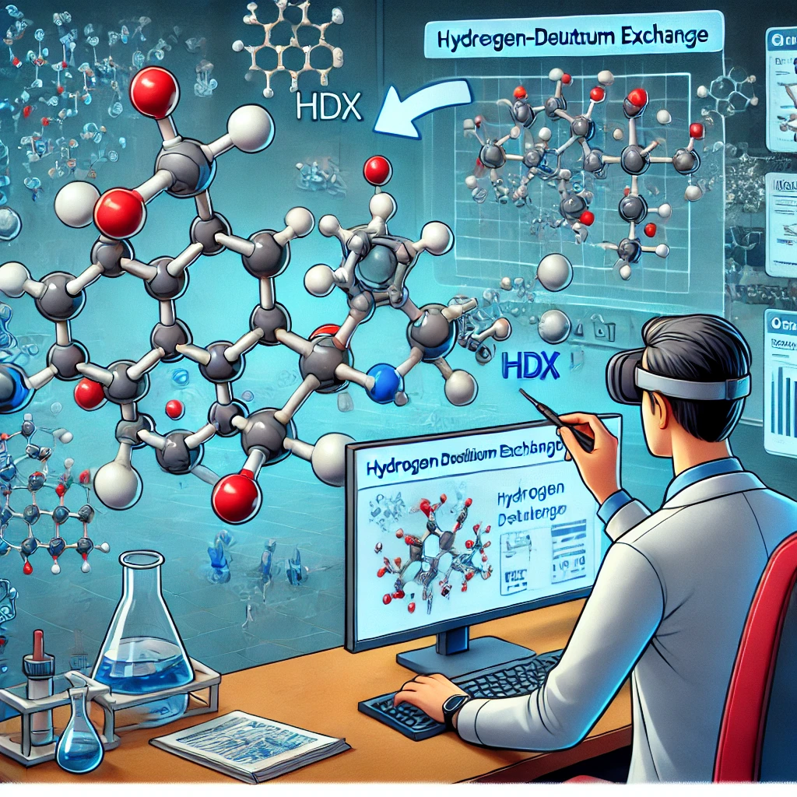
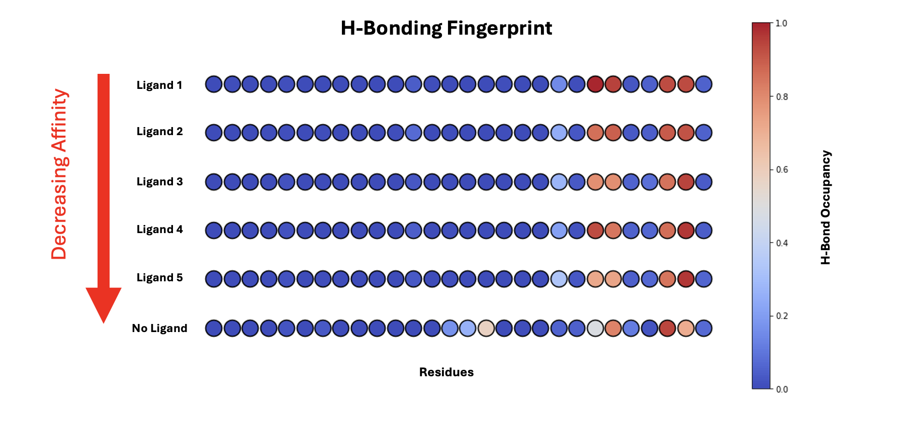

# PHENOMS

**P**ython-based **H**ydrogen-deuterium **E**xcha**N**ge **O**f **M**olecular dynamics **S**imulations

## Table of Contents
- [Introduction](#introduction)
- [Installation](#installation)
- [Usage](#usage)
- [Contributing](#contributing)
- [License](#license)

## Introduction
PHENOMS is a Python-package for simulating hydrogen-deuterium exchange (HDX) experiments. It provides a suite of tools to perform and analyze an in-silico HDX experiment using MD simulations.

## Example Visualization from Protein-Ligand SAR Series

## Installation

## Usage

## License
This project is licensed under the MIT License. See the [LICENSE](./LICENSE) file for more information.