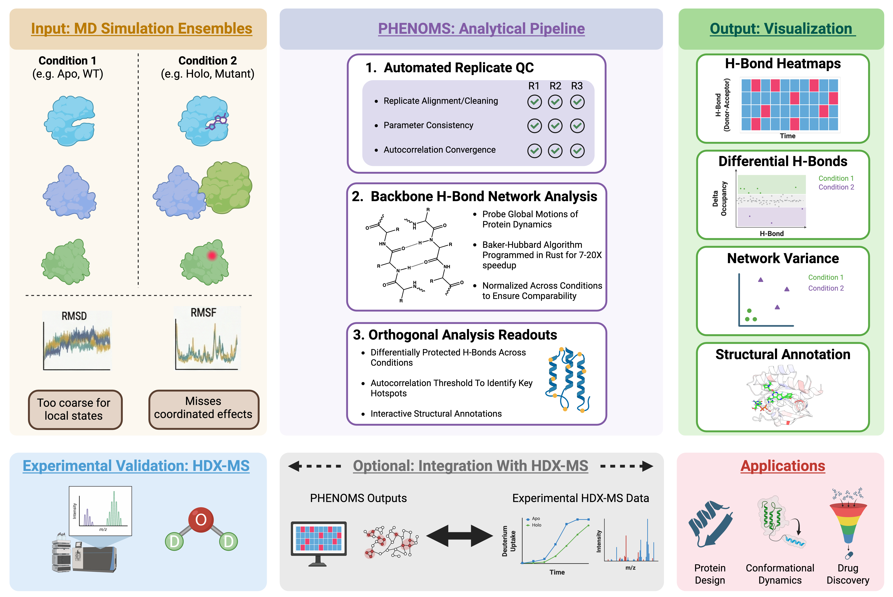

# PHENOMS

Python-based Hydrogen-Deuterium Exchange of Molecular Dynamics Simulations



## Table of Contents
- [Introduction](#introduction)
- [Installation](#installation)
- [Usage](#usage)
- [Outputs & benchmarks](#outputs--benchmarks)
- [Contributing](#contributing)
- [License](#license)

## Introduction
PHENOMS is a Python package for MD-based hydrogen-bond/HDX-style analysis across single trajectories or comparison sets. It supports:
- Rust-accelerated Baker-Hubbard-style H-bond detection
- Backbone-only or all-H-bond analysis
- Occupancy tables, heatmaps, differential comparison, and connectivity exports
- Reproducible benchmarking (local or Docker; 4-thread defaults with optional 1-CPU reference mode)

## Installation

Use the **`phenoms`** conda environment (defined in `environment.yml`).

```bash
conda env create -f environment.yml
conda activate phenoms
pip install -e .
```

**Rust extension (recommended for speed):** Install [Rust](https://rustup.rs/), then from the repo root:

```bash
pip install maturin
maturin develop --release
```

This builds `phenoms_hbond_rs`. Detection uses **Rust** when available; **Polars** (Python dependency) accelerates **occupancy aggregation** only—not the geometry kernel.

Optional extras: `pip install -e ".[benchmark]"` (MDAnalysis) if you run the kernel benchmark script.

## Usage

### Where files go

By default, scripts and `SimulationSet(..., output_dir=...)` write under **`./phenom_outputs/`** (created next to your current working directory). Override globally with:

```bash
export PHENOMS_OUTPUT_DIR=/path/to/my_phenom_runs
```

### Single simulation set (backbone N-O)

```python
from phenoms import SimulationSet, default_output_root

sim = SimulationSet(
    pdb_files=["rep1.pdb", "rep2.pdb"],
    resid_range=(50, 70),  # None = whole protein for heatmap focus
    sub_frames=100,
    output_dir=default_output_root() / "my_run" / "set_a",
)
sim.run()
# CSVs: output_dir/raw_data/*_hbonds.csv, *_occupancy.csv, *_pivot.csv, manifest.json
```

### Two sets (comparison)

```python
from phenoms import SimulationSet, ComparisonSet, default_output_root

base = default_output_root() / "my_run"
a = SimulationSet(pdb_files=["a1.pdb", "a2.pdb"], resid_range=(50, 70), sub_frames=100).run()
b = SimulationSet(pdb_files=["b1.pdb", "b2.pdb"], resid_range=(50, 70), sub_frames=100).run()
cmp = ComparisonSet(a, b, label_a="apo", label_b="holo")
cmp.compare()
cmp.export_comparison_artifacts(base / "comparison")
```

### H-bond detection only (API)

```python
from phenoms import detect_hbonds, detect_hbonds_with_occupancy

# All donor/acceptor classes (Rust when built)
df_all = detect_hbonds("trajectory.pdb", sub_frames=500, backbone_only=False, use_rust=True)

# Backbone N-O only (same as SimulationSet pipeline)
df_bb = detect_hbonds("trajectory.pdb", backbone_only=True, use_rust=True)

hbonds_df, occ_df = detect_hbonds_with_occupancy(
    "trajectory.pdb",
    sub_frames=100,
    backbone_only=False,
    output_csv_path="hbond_occupancy.csv",
)
```

### One-shot backbone workflow

```python
from phenoms import run_backbone_hbond_analysis, default_output_root

sim = run_backbone_hbond_analysis(
    ["r1.pdb", "r2.pdb"],
    resid_range=None,
    sub_frames=100,
    plot_heatmaps=False,
    output_dir=default_output_root() / "quick",
)
```

### Optional auto-QC in `SimulationSet.run`

```python
sim = SimulationSet(["rep1.pdb", "rep2.pdb"], sub_frames=250)
sim.run(
    qc=True,
    mdp_files=["rep1.mdp", "rep2.mdp"],   # optional
    skip_mdp_consistency=False,           # set True to skip MDP checks
    qc_fail_on_nonconverged=True,         # raises if any replicate fails RMSD convergence
)
qc_report = sim.get_qc_report()
```

QC currently includes:
- RMSD-based convergence check per replicate (window-shift + drift check)
- MDP key consistency check (when `mdp_files` are provided)
- Informative failure messages showing which replicate/parameter failed

### Demo plots (repo test PDBs)

```bash
python scripts/run_test_data_plots.py --resid-range 50 70 --sub-frames 50
```

Outputs default to `./phenom_outputs/test_plots/...` (or `$PHENOMS_OUTPUT_DIR/test_plots/...`). Use `--output-dir` to set an explicit base.

### Trajectory preprocessing helpers (GROMACS + numbering)

```bash
# Export centered, fitted, protein-only multi-frame PDB from xtc+tpr
python scripts/preprocess_gromacs_to_pdb.py \
  --run-dir /path/to/run \
  --out-dir /path/to/exports \
  --frame-dt-ps 1000

# Renumber many PDBs to a common reference sequence/numbering
python scripts/renumber_many_to_reference.py \
  --reference ref.pdb \
  --mobile-dir ./exports \
  --mobile-glob "*.pdb" \
  --output-dir ./exports_renumbered
```

## Outputs & benchmarks

### Core analysis outputs

- **Per-replicate frame-level H-bonds** (`*_hbonds.csv`): donor/hydrogen/acceptor indices, frame number, and bond label.
- **Occupancy summaries** (`*_occupancy.csv`): per-bond present-frame counts and occupancy fractions.
- **Pivot matrices** (`*_pivot.csv`): bond-label x frame tables used for heatmaps, comparisons, and downstream reduction.
- **Run manifest** (`manifest.json`): run metadata (`sub_frames`, `resid_range`, threshold settings, input files).

### Differential backbone H-bond outputs

- **Comparison table** (`comparison.csv` via `ComparisonSet.export_comparison_artifacts`): condition-level occupancy differences and clipped differential metrics for identifying differentially protected backbone H-bonds.
- **Difference plots** (`ComparisonSet.plot_difference`): condition A vs B differential protection visualization with thresholding/autocorrelation options.

### Connectivity and structure outputs

- **Interactive connectivity graphs** (`ComparisonSet.export_connectivity_graph_html`): residue-level networks from bond occupancies or occupancy deltas.
- **Community-aware connectivity graphs** (`ComparisonSet.export_connectivity_community_graph_html`): community assignments with optional node/summary CSV tables.
- **Structure annotation outputs** (`write_pdb_bfactors` / `SimulationSet.write_structure_bfactors`): PDB files with B-factors set from occupancy/difference metrics for PyMOL/Chimera coloring.

### Default output location

- By default outputs go to `./phenom_outputs/` (or `$PHENOMS_OUTPUT_DIR` if set).
- For scripted runs, pass explicit `output_dir` (API) or `--output-dir` (CLI) to keep artifacts in a user-chosen project folder.

### Benchmark outputs

- **Kernel benchmark CSVs** (Rust vs MDTraj vs MDAnalysis, 4-thread default):  
  `python scripts/benchmark_kernel.py --sub-frames 250`
- **Docker reproduction**: see **[docker/README.md](./docker/README.md)** for containerized benchmark runs.

#### Latest 4-CPU Docker run (reference)

Setup: 3 replicate trajectories, first 250 frames per replicate (from 500 ns PDB trajectories), 2,722 atoms each, run in Docker with `--cpus=4` and 4-thread settings.

| Method | Total time (s) | Rust speedup |
|------|-----:|-----:|
| Rust kernel (`run_baker_hubbard`) | **0.047** | **1.00x** |
| MDTraj (`baker_hubbard`) | 0.803 | 17.19x |
| MDAnalysis (`HydrogenBondAnalysis.run`) | 1.126 | 24.12x |

## Contributing
Contributions welcome; open an issue or PR.

## License
This project is licensed under the MIT License. See the [LICENSE](./LICENSE) file for more information.
